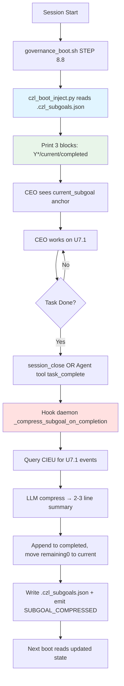

# HiAgent CZL Integration Design — Working Memory Compression for Multi-Session Campaigns

**Context**: Board discovered CIEU 19 events → 0 lesson extracted; boot 3-source drift (obligations vs DISPATCH vs priority_brief); no `current_subgoal` anchor. HiAgent's subgoal-tree compression model solves this. CEO dogfood'd `.czl_subgoals.json` v0.1 (campaign/current/completed/remaining).

**Mapping**: HiAgent → CZL
- Y* = priority_brief.md (existing)
- Subgoal tree = `.czl_subgoals.json` (new)
- Action-observation transcript = sub-agent JSONL (exists, thrown away)
- Compressed summary = completed[].summary (2-3 lines)
- Boot injection = 3 blocks only: Y* / current / completed summaries

**Design Goal**: Boot reads O(1) lines instead of dumping stale obligations. Sub-agent transcripts auto-compress on completion. CEO always has `current_subgoal` anchor.

---

## 1. Hook Integration Points

### 1.1 Compression Trigger (Post-Completion)
**Location**: `ystar/_hook_daemon.py` → new `_compress_subgoal_on_completion()` method  
**Trigger**: Agent tool `task_complete` signal OR `session_close_yml.py` detects CIEU `TASK_COMPLETED` event for current_subgoal.id  
**Action**:
1. Read `.czl_subgoals.json` → get `current_subgoal.id` (e.g., "U7.1")
2. Query CIEU for all events matching `agent_id` + `task_id=U7.1` + timestamp range
3. Extract key state transitions (tool_use success/fail, pivot, Rt+1 changes)
4. Generate 2-3 line summary (algorithm: §1.4)
5. Append to `completed[]` with: `{id, goal, summary, duration_min}`
6. If `remaining[]` not empty → auto-move `remaining[0]` → `current_subgoal`
7. Write back `.czl_subgoals.json` + emit CIEU `SUBGOAL_COMPRESSED`

### 1.2 Boot Injection (Governance Boot)
**Location**: `scripts/governance_boot.sh` → STEP 8.8 (new, after YML bridge 8.7)  
**Action**:
```bash
echo "[8.8/11] CZL subgoal injection..."
python3 "$YSTAR_DIR/scripts/czl_boot_inject.py" "$AGENT_ID"
```
**Script `czl_boot_inject.py`**:
1. Read `.czl_subgoals.json`
2. Output 3 blocks ONLY:
   ```
   Y* = {priority_brief v0.X link}
   Current = U7.1: 修 twin_evolution fallback chain (owner: Maya via Ethan)
   Completed (5 most recent):
     U6: wire_integrity cron + WIRE_BROKEN CIEU [L4]
     U5: labs_router env-var P1-F [L3]
     ...
   ```
3. **STOP dumping** old `ACTIVE OBLIGATIONS` section from governance_boot.sh:410-432

### 1.3 Current Subgoal Push Logic
**Owner**: CEO (explicit) for now, **not** auto-move in hook.  
**Reason**: Avoid silent drift if remaining[0] is wrong priority. Board might reprioritize.  
**Implementation**: CEO says "push U8" → shell script edits `.czl_subgoals.json` moves U8 from `remaining[]` → `current_subgoal` → pkill daemon to reload.

**Future (Phase 2)**: Hook detects `current_subgoal.rt1_predicate` satisfied → auto-suggest next, await CEO/CTO confirm.

### 1.4 Compression Algorithm
**Who writes summary?** Post-hook LLM (claude-3-5-haiku-20241022 via Anthropic SDK in hook daemon).  
**Why not sub-agent self-write?** Sub-agent has incentive to inflate success; post-hook audit is neutral.  
**Input**: CIEU events for task_id + sub-agent final Yt+1/Rt+1 report  
**Prompt**:
```
Compress this task transcript into 2-3 lines. Include: what shipped [LX maturity], key blockers overcome, measurable outcome. Example:
"hook_session_start.py 加 _append_yml_memories 载 15 CEO memories; hook_session_end.py 调 session_close_yml.py; settings.json 加 SessionEnd hook. 4/4 E2E 过. [L3]"
```
**Fallback**: If LLM API fails → write raw Yt+1 claim (fail-open), mark `[AI_COMPRESS_FAILED]`.

---

## 2. Minimal Implementation (Board Spec: "两个 JSON 文件")

### 2.1 New Files
1. **`.czl_subgoals.json`** (campaign root, already dogfood'd by CEO)
2. **`scripts/czl_boot_inject.py`** (≤80 lines, reads JSON + prints 3 blocks)

### 2.2 Modified Files
1. **`scripts/governance_boot.sh`**:
   - Add STEP 8.8 call `czl_boot_inject.py`
   - **DELETE** STEP 9 (ACTIVE OBLIGATIONS dump, lines 410-432)
2. **`ystar/_hook_daemon.py`**:
   - Add `_compress_subgoal_on_completion(task_id)` method
   - Wire to `_handle_task_complete` event (new event type, emit from Agent tool or session_close)
3. **`scripts/session_close_yml.py`**:
   - After writing session memory, check if `current_subgoal.id` in `.czl_subgoals.json` matches last CIEU TASK_COMPLETED → trigger compression

### 2.3 Division of Labor with YML Memory
**YML (`session_boot_yml.py`)**: Agent-general memories, obligation-related context, top-N lessons  
**CZL (`.czl_subgoals.json`)**: Campaign-specific subgoal tree, current task anchor, completed summaries  
**Overlap**: None. YML = "what you learned"; CZL = "what you're doing".

### 2.4 Relationship with obligation_tracker
**Deprecate obligation_tracker for CEO.** Obligations are task-level, not subgoal-level. CEO operates at subgoal granularity (U1-U10), CTO/engineers operate at task-card granularity.  
**Keep for engineers.** Engineers still track `.claude/tasks/eng-kernel-042.md` completion as obligations.  
**Migration**: Existing CEO obligations in `.ystar_omission.db` → one-time script converts to `remaining[]` entries in `.czl_subgoals.json`.

---

## 3. Dogfood Migration Plan

### 3.1 Schema v0.1 (Current)
CEO's `.czl_subgoals.json` serves as canonical schema. Fields:
```json
{
  "y_star_ref": "reports/priority_brief.md or next_session_pX.md",
  "campaign": "Free-form string",
  "current_subgoal": {"id","goal","owner","agent_id","started","rt1_predicate"},
  "completed": [{"id","goal","summary","duration_min"}],
  "remaining": [{"id","goal","eta_min"}],
  "rt1_status": "X/Y criteria met",
  "boot_injection_spec": "Documentation field"
}
```

### 3.2 Next Campaign Scaffolding
**Trigger**: CEO says "new campaign: [name]" OR priority_brief.md version bumps  
**Script**: `scripts/czl_new_campaign.sh <name>`  
**Action**:
1. Archive old `.czl_subgoals.json` → `memory/archive/czl_campaign_YYYYMMDD.json`
2. Generate new stub:
   ```json
   {
     "y_star_ref": "reports/priority_brief_vX.Y.md",
     "campaign": "<name>",
     "current_subgoal": null,
     "completed": [],
     "remaining": [],
     "rt1_status": "0/0"
   }
   ```
3. Emit CIEU `CAMPAIGN_STARTED`

### 3.3 Migration from Old Obligations
**One-time script**: `scripts/migrate_obligations_to_czl.py`  
**Action**: Read `.ystar_omission.db` pending obligations for `ceo` → populate `remaining[]` with `{id: auto-U1..UN, goal: obligation.content, eta_min: null}`

---

## 4. Risk / Failure Modes

### 4.1 `.czl_subgoals.json` Itself Drifts
**Detection**: Add to `scripts/wire_integrity_check.py`:
```python
if current_subgoal and current_subgoal["started"]:
    age_hours = (now - parse_iso(current_subgoal["started"])).total_seconds() / 3600
    if age_hours > 24:
        emit_cieu("CZL_STALE_SUBGOAL", {"id": current_subgoal["id"], "age_hours": age_hours})
```
**Enforcement**: Same as priority_brief — if stale >48h, boot FAIL.

### 4.2 Sub-Agent Summary Is Generic/Evasive
**Problem**: LLM compression outputs "completed task successfully [L5]" with no specifics.  
**Detection**: Regex check `summary` for ≥3 concrete nouns (file names, numbers, test counts). If <3 → flag `[SUMMARY_VAGUE]`.  
**Fallback**: CEO manually rewrites summary before next boot (governance_boot warns if any completed[] has `[SUMMARY_VAGUE]`).

### 4.3 Rt+1 Predicate Not Programmatic
**Problem**: `rt1_predicate: "twin_evolution lesson count > 8"` — who checks this?  
**Solution**: Add optional `rt1_script` field:
```json
"rt1_script": "python3 scripts/verify_twin_evolution.py --count 8"
```
Hook daemon runs script on TASK_COMPLETED → if exit 0, mark completed; if exit 1, keep in `current_subgoal` with status "predicate_failed".

### 4.4 CEO Forgets to Push Next Subgoal
**Detection**: If `current_subgoal == null` AND `remaining[]` not empty → boot WARNING (not FAIL).  
**Mitigation**: governance_boot prints: "⚠️ No current subgoal but U8-U10 pending — CEO must push next."

---

## Flow Diagram



---

## Maturity: [L2 — Design Complete]

**Next**: Board review → CTO implement hooks → CEO dogfood next campaign → measure boot dump line count (target: ≤15 lines vs current ~80).

**Dependencies**: None. No new packages. Uses existing: sqlite3, json, pathlib, Anthropic SDK (already in ystar.gov deps).

**Timeline**: 2h implementation + 1h E2E test with mock campaign.
